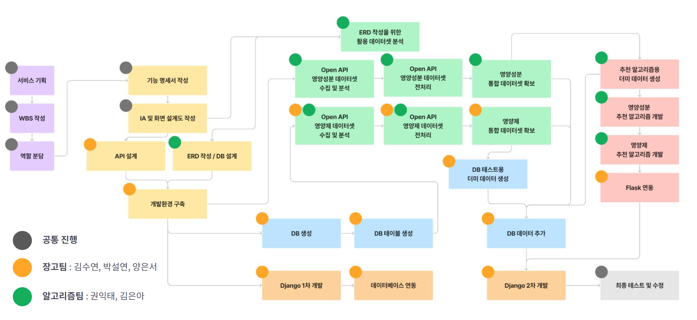
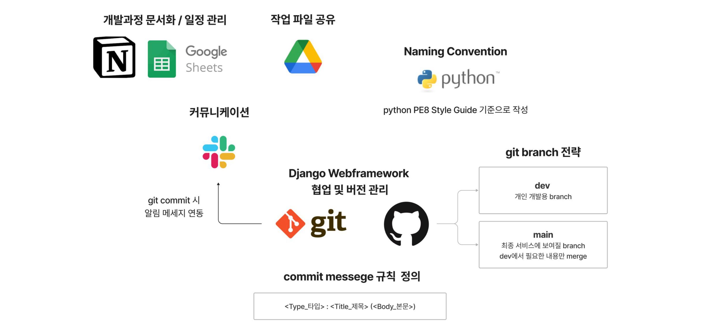
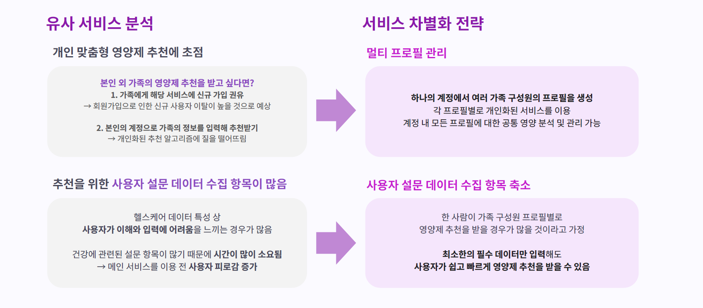
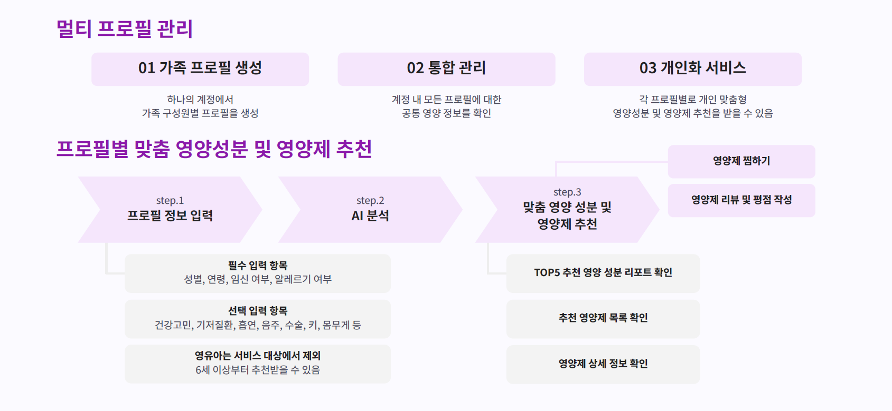
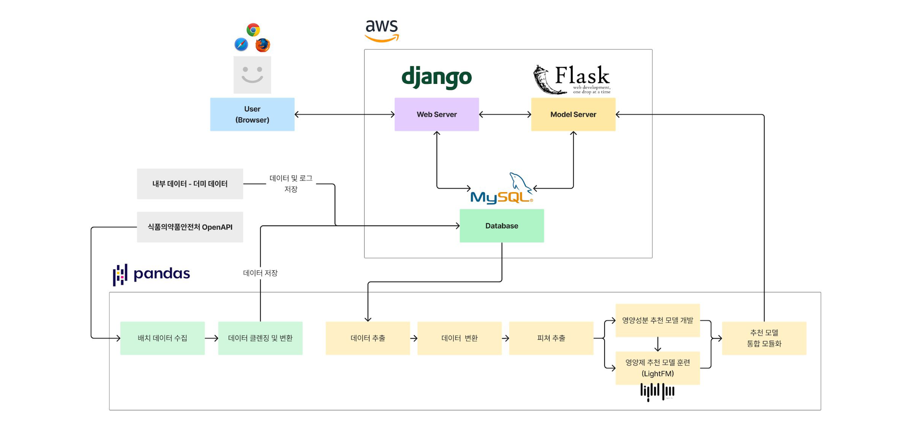
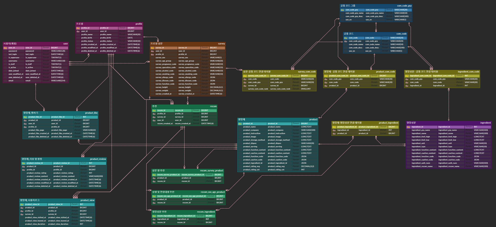
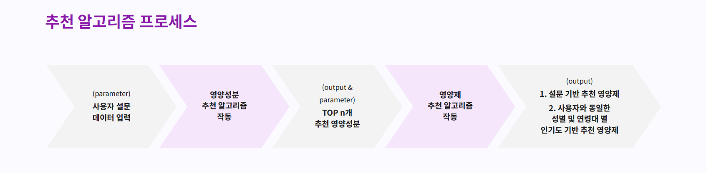

# 💊필소굿(PillSoGood) Project
### 우리 가족 맞춤 영양제 추천 서비스


## 1. 프로젝트 소개
### 필소굿은 **가족 기반으로 맞춤 영양제를 추천**해주는 웹 서비스입니다.
- 💊 AI 기반으로 **개인 맞춤형 영양성분 및 영양제 추천**합니다.
- 👨‍👩‍👧‍👦 **하나의 계정**에서 **멀티 프로필을 생성**해 **여러 사람이 함께 영양 관리**를 할 수 있습니다.

## 2. 프로젝트 진행
### 1) 프로젝트 기간
```
- 총 개발기간 : 2024.04.05 ~ 2024.05.16(6주)
- 기획 : 2024.04.05 ~ 2024.04.12(8일)
- 설계 : 2024.04.13 ~ 2024.04.23(11일)
- 구현 : 2024.04.24 ~ 2024.05.14(21일)
- 테스트 및 버그 수정, 산출물 정리 : 2024.05.14 ~ 2024.05.17(3일)
- 추가 리팩토링 기간 : 2024.05.30 ~ 2024.08.15(11주)
```

### 2) TEAM 소개
|     이름      |            역할             |                  Contact                  |
| :-----------: | :-------------------------: | :---------------------------------------: |
|김은아(팀장)|일정 및 문서화 관리, ERD 및 DB 설계, 더미 데이터 생성, 추천 알고리즘 개발|  [Github](https://github.com/silverA-01)   |
|권익태|ERD 및 DB 설계, 더미 데이터 생성, 추천 알고리즘 개발|  [Github](https://github.com/Dreamliners)  |
|김수연|API 설계, 개발환경 구축, Django 백엔드, Flask 모델 서버 개발|  [Github](https://github.com/metaego)  |
|박설연|API 설계, Django 백엔드/프론트엔드, MySQL DB 관리| [Github](https://github.com/happydgtnmd) |
|양은서|화면 설계, API 설계, 더미 데이터 생성, Django 백엔드/프론트엔드, 데이터 분석|  [Github](https://github.com/yant1001)  |

- **공통 진행** 
  - 서비스 기획
  - 기능 명세서 작성
  - IA 및 화면 설계도 작성
  - Open API 영양성분 및 영양제 데이터 수집 및 처리

### 3) Work Flow


### 4) 개발 전략


### 📄 문서화
|분류|설명|링크|
|:-----------|:-----------|:-------------------------|
|회의록|6주간 총 35회 회의 내용 기록|[바로가기](https://pillsogood.notion.site/554e11df09284b7ea2a53cddd43867d4?pvs=4)|
|일정 및 TASK 관리|WBS 및 TASK 관리|[바로가기](https://pillsogood.notion.site/Schedule-242c3e33a4fa4ccc9a18d6dd35fb7426?pvs=4)|
|기능 명세서|서비스 요구사항을 반영한 필수 기능에 대해 우선순위 부여 후 MVP 확정|[바로가기](https://pillsogood.notion.site/3-7fe394f5621d45149d42946b00acbe92?pvs=4)|
|화면 설계도|Figma로 작성|[바로가기](https://www.figma.com/board/XeUfdNvw9HsDIL34uIQVCQ/PillSoGood_%ED%99%94%EB%A9%B4%EC%84%A4%EA%B3%84%EB%8F%84?node-id=0-1&t=gg3ZgqVuaNN8h9dI-1)|
|Naming Convention|python PE8 Style Guide 기준으로 작성| [바로가기](https://pillsogood.notion.site/Coding-Conventions-6514279500074b60bdec95d1762ffe1d?pvs=4)|
|git commit messege 규칙|정의된 규칙에 맞게 작성 후 git push| [바로가기](https://pillsogood.notion.site/git-commit-message-f118e70f1c9445cfb9b50228a37285a7?pvs=4)|
|API 설계|RESTful API 설계 규칙을 준수하여 APP별로 Web API 설계|[바로가기](https://pillsogood.notion.site/API-bc4b435405c94316b432f132343cc3a1?pvs=4)


## 3. 기획 배경
### 국내 건강기능식품 시장 6조 시대
- 국내 **건강에 대한 관심도 및 건강기능식품 소비**가 **지속적으로 증가**함에 따라 **건강기능식품시장 꾸준히 성장**
  - 국내 건강기능식품 구매 경험률 81.2% / 가구당 평균 구매액 36만원
  - 국내 건강기능식품 시장 5년 연속 시장 규모 27% 확대 / 6조 2000억원대 추정
### 개인형 맞춤 영양제 서비스에 대한 수요 증가
- 코로나 팬데믹 이후 건강을 중심으로 소비하는 **헬스 디깅(Health Digging) 트랜드**와 소비자 스스로 건강을 챙기는 **셀프 메디케이션(Self-medication) 트랜드** 확산
- 이에 따라 **자신에게 맞는 영양제를 알아보고 맞춤형으로 구매하려는 수요 증가**
### 공동 취식에 대한 니즈 파악
- **건강기능식품은** 본인 뿐만 아니라 **가족 구성원의 몫까지 같이 직접 구매**하는 경향이 높음
- 두 사람 이상 섭취하는 **공동 취식 시장의 비중이 꾸준히 성장**

> - 📰 [한국건강기능식품협회 보도자료](https://www.khff.or.kr/user/info/InfoBoardUserView.do?_menuNo=369&boardSeqno=10035&postsSeqno=118067)
> - 📰 [관련 기사](https://bravo.etoday.co.kr/view/atc_view/14389)
  
## 4. 서비스 차별화 전략


### 타겟 페르소나 설정
> 🙆 **김은주(대기업 마케팅 부서 과장/42세)**
> 
> - **가족 구성원** : 남편(IT 개발자/44세), 아들(중학생/15세), 딸(초등학생/11세), 엄마(가정주부/63세)
> 
> - **라이프 스타일**
>   - 주중에는 직장에서 바쁘게 일하지만, 주말에는 가족과 시간을 보내며 건강한 생활을 유지하려고 노력
>   - 식습관과 운동에 관심이 많으며, 가족의 건강을 위해 정기적으로 영양제 구매 및 섭취를 관리
>   - 새로운 건강 정보와 제품에 민감하며, SNS와 온라인 커뮤니티에서 최신 건강 트렌드를 적극적으로 탐색
>   - 시간이 부족해 복잡한 절차를 싫어하며, 간편하게 사용할 수 있는 서비스를 선호
> 
> - **행동 패턴**
>   - 온라인 쇼핑을 자주 이용하며, 제품 리뷰와 추천을 꼼꼼히 확인함
>   - 건강 상태를 관리하기 위해 헬스 케어 앱을 사용해왔으며, 사용자 친화적인 인터페이스와 맞춤형 추천 기능을 선호함
> 
> - **필요 및 요구사항**
>   - **가족 영양제 관리** : 가족 구성원마다 필요한 영양제를 다르게 추천받고, 하나의 계정으로 가족의 영양제를 손쉽게 관리할 수 있는 서비스를 원함
>   - **간편한 사용성** : 가족의 정보를 많이 입력해야 하는 번거로움 없이, 간단한 설문 정보만 입력해도 개인 맞춤형 영양제를 추천받고 싶음
>   - **신뢰성** : 영양제 추천의 신뢰성을 중요하게 생각하며, 데이터에 기반한 과학적인 추천을 원함

## 5. 서비스 주요 기능

### 1) 멀티 프로필 관리
1. **가족 프로필 생성** : 하나의 계정에서 가족 구성원별 프로필을 생성
2. **계정 통합 영양 관리** : 계정 내 모든 프로필에 대한 공통된 영양 정보를 확인
3. **개인화 서비스** : 각 프로필별로 개인 맞춤형 영양성분 및 영양제 추천을 받고, 히스토리를 확인

### 2) 프로필 별 맞춤 영양성분 및 영양제 추천
#### 1. **프로필 정보 입력**
- 필수 입력 항목
  - 성별, 연령 : 신체 주기에 따른 필요 영양제를 반영하기 위해 수집
  - 임신 여부, 알레르기 여부 : 치명적이거나 생명을 위협하는 이상반응에 대한 검증을 위해 수집
- 선택 입력 항목 : 건강고민, 기저질환, 흡연, 음주, 수술 여부, 키, 몸무게
- 6세 미만의 영유아는 서비스 대상에서 제외
  - 실질적으로 추천할 수 있는 영양제 항목이 적고, 위해성에 대해 다른 연령대보다 높은 영향도를 받을 것으로 판단하여 제외
#### 2.  **프로필 정보 및 협업 필터링을 바탕으로 AI 영양성분 및 영양제 추천**
#### 3.  **맞춤 영양성분 및 영양제 추천**
  - TOP5 추천 영양성분 리포트 확인
  - 프로필 설문 & 성별 및 연령대별 추천 영양제 목록 확인
  - 영양제 상세 정보 확인
#### 4. **영양제 찜하기**
#### 5. **영양제 리뷰 및 평점 작성**

## 6. 서비스 시연
### 1) 로그인 및 프로필 생성
> **[기본 프로필 생성]**


> **[멀티 프로필 생성]**


```markdown
1. 로그인 페이지 - 회원가입
2. 로그인 > 프로필 선택 페이지 이동
3. '프로필 생성' 버튼 클릭 > 프로필 정보 입력
4. 프로필 선택 페이지에서 생성된 프로필 확인
```

---

### 2) 개인 프로필 영양제 추천 받기


```markdown
1. 프로필 선택
2. Home - '건강설문하고 영양제 추천받기' 버튼 클릭 or 'AI영양제추천받기' 메뉴 버튼 클릭
3. AI 영양제 추천 받기
   - 추천받을 프로필 정보 확인 및 수정 
   - 건강고민 최대 5개 체크(선택 사항)
4. 추천 결과
   1. TOP5 추천 영양성분 리포트 확인
     - '추천 영양제 보기' 버튼 클릭 > 해당 영양성분 관련 추천 영양제 목록 페이지로 이동
   2. 추천 영양제 관련 두 가지 목록 확인
     - 프로필 정보 및 추천 영양성분을 바탕으로 한 추천 목록 생성
     - 프로필과 동일한 연령대 및 성별을 바탕으로 한 인기도 기반 추천 목록 생성
     - 영양제 추천 목록 '더보기' 클릭 > 관련된 추천 영양제 목록 페이지로 이동
5. '영양제 이름 or 사진' 클릭 > 해당 영양제 상세 페이지로 이동
   - 해당 영양제에 대한 정보 확인
   - 영양제 찜하기
   - 리뷰 및 평점 입력
6. HOME
  - AI 영양제 추천받기 이후 프로필 맞춤 영양제 추천 목록 생성 확인
```

---

### 3) 프로필 별 개인 영양 관리


```markdown
1. '계정 관리' 버튼 클릭 > 회원정보 수정 페이지 이동
2. 회원정보 수정
  - 비밀번호 수정
  - 회원탈퇴 기능(+팝업 경고 메세지)
2. 영양성분 AI 추천 기록
3. 최근 조회한 영양제 제품 목록 확인
4. 찜한 영양제 목록 확인
5. 리뷰 작성한 영양제 확인
```

---

### 4) 계정 통합 영양 관리


```markdown
1. 계정 통합 최근 관심 건강 확인
2. 계정 내 프로필의 공통 추천 영양성분 확인
3. 계정 통합 추천 영양제 목록 확인
4. 계정 통합 최근 찜한 영양제 확인
```


## 7. 서비스 아키텍처


### Database - MySQL
- **동시 다중 사용자 지원** : Django에 내장되어 있는 sqlite는 동시 처리 작업이 제한되기 때문에 MySQL이 5인 팀 개발에 더 적합하다고 판단
- **빠른 속도와 효율적인 성능 제공** : 본 프로젝트는 프로토타입을 만드는 과정이고, 주로 데이터를 읽고 사용자에게 표시하는 작업이 많은 부분을 고려했을 때 PostgreSQL보다 익숙하게 사용할 수 있는 MySQL이 더 적합하다고 판단

### 추천 모델 서버 - Flask
- 추천 시스템 모델이 작동할 때 웹 서버 프레임워크에 영향이 가지 않도록 **추천 모델 전용 서버를 Flaks로 구축**
- Flask는 Python 기반의 웹 서버를 만드는 간결한 프레임워크이기 때문에 **Python 기반인 본 프로젝트 개발 환경에 적합**하고, **빠르게 서버 구성이 가능**하여 모델 서버로 선택


## 8. ERD

- 📄 [ERD 및 DB 설계](https://pillsogood.notion.site/Req-2-1-fb4aeeb8f49f423b9522d46dba8fe4bb?pvs=4)


### M:N 관계 문제 해결
- 서비스 특성상 **필연적으로 데이터 간의 M:N 관계를 가지는 문제 발생**
  - ex. 영양성분 - 영양제, 영양제 - 건강기능, 영양제 - 주의사항, 추천 - 영양제 등
- **Join 테이블을 활용**해 **1:M, N:1 관계를 형성**하도록 설계
  - Long Data를 지향하여 향후 집계에 용이하도록 구성하기 위해 Join 테이블을 활용
- [추가 개발] Join 테이블과 별도로 **JSON 데이터 타입 필드 추가**
  - **추천 시스템에 활용되는 데이터의 경우 하나의 테이블에서 조회할 수 있도록 **JSON 데이터 타입 필드를 추가
  - **데이터 무결성**을 위해 **Join 테이블을 기반**으로 **지속적인 JSON 필드값 업데이트** 필요
  - Join 테이블의 활용했을 때와 성능을 비교해 서비스에 더 적합한 방식으로 데이터 집계 및 조회에 활용

### 코드성 테이블 활용
- 서비스 특성상 사용자가 입력한 설문 데이터와 영양성분 및 영양제의 데이터의 건강기능, 주의사항에 대해 매칭될 수 있는 **카테고리 분류가 필요**
- **코드성 테이블 생성해 해당 카테고리에 대한 코드를 활용**하고, 이를 바탕으로 Join 테이블 생성
  - `com_code_grp` : 공통 코드 그룹 테이블
  - `com_code` : 공통 코드 테이블

## 9. 추천 시스템



## 10. 수상
- 멀티캠퍼스 - 기업요구사항 기반 문제해결 프로젝트 최우수상 🥇